  

  <h1 align="center" style="color: #39FF14;">Gerson Fuentes</h1>
  <h3 align="center" style="color: #39FF14;">⚡ Full Stack Developer ⚡</h3>
  <h2>📟 Desarrollador Senior | Especialista en Frontend y Backend 📟</h2>
  
Explorando nuevas fronteras digitales y construyendo sistemas de escala galáctica.

 

  <h3 style="color: #39FF14;">☄️ Tecnologías & Herramientas del Cosmos</h3>

<table align="center">
  <tr>
    <td align="center" width="250">
      <b>🖥️ Frontend</b>  
        
      React • Vite • JS (ES6+) • CSS Puro • Three.js
    </td>
    <td align="center" width="250">
      <b>⚙️ Backend</b>  
       
      
       
      Node.js • Sequelize (ORM) • JWT Security
    </td>
  </tr>
  <tr>
    <td align="center" width="250">
      <b>🗄️ Bases de Datos</b>  
       
       
      PostgreSQL • MySQL • JSON Server
    </td>
    <td align="center" width="250">
      <b>🛠️ Herramientas & Flujo</b>  
       
       
      Git • Postman • Trello • Metodologías Ágiles
    </td>
  </tr>
</table>

 

  <h2>🚀 Proyectos de Alto Impacto 🚀</h2>
  

  <table align="center">
    <tr>
      <td align="center" width="800">
         
        
<b>Impacto Real • Manejo Seguro de Datos • Rendimiento Optimizado</b>

        
<i>Sistema integral de registro y administración diseñado para un entorno real. Desarrollado con los más altos estándares de calidad, garantizando interfaces intuitivas, escalabilidad y una seguridad estricta en el manejo de datos sensibles.</i>

         
        
        
          
      </td>
    </tr>
  </table>

 

  <h3>🛰️ Misiones & Conceptos Avanzados</h3>

<table align="center">
  <tr>
    <td align="center" width="400">
        
      
<i>Demostración de Backend robusto y Arquitectura MVC. Implementa autenticación segura (JWT), base de datos con ORM (Sequelize) y simulaciones de crédito en tiempo real.</i>

    </td>
    <td align="center" width="400">
        
      
<i>Demostración de Frontend inmersivo. Enfoque absoluto en UI/UX moderna, interactividad fluida, diseño responsive y rendimiento óptimo en la web.</i>

    </td>
  </tr>
</table>

 

  <h3>📊 Estadísticas de GitHub</h3>
  
  
   
  
    
  <picture>
    <source media="(prefers-color-scheme: dark)" srcset="https://raw.githubusercontent.com/gersonfocusfwd/gersonfocusfwd/output/pacman-contribution-graph-dark.svg">
    <source media="(prefers-color-scheme: light)" srcset="https://raw.githubusercontent.com/gersonfocusfwd/gersonfocusfwd/output/pacman-contribution-graph.svg">
    
  </picture>

 

  <h3>📡 Contacto Estelar</h3>
  
  

